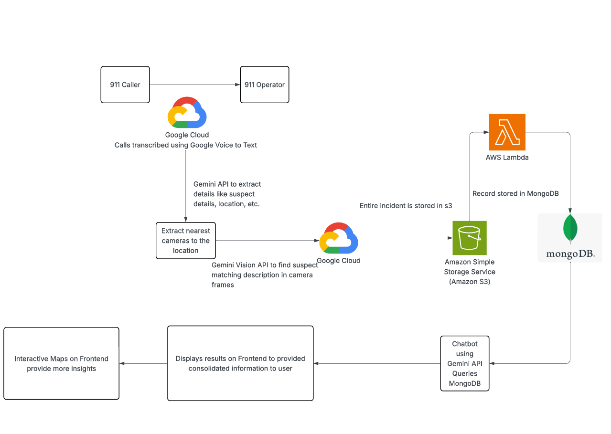

# 🦅 Eye AI

> **🏆 Winner: Best Use of Google Gemini API at HackRUC**

**Eye AI** is an event-driven, serverless situational awareness platform designed for emergency dispatchers. By fusing audio transcription, entity extraction, and multi-camera computer vision, it transforms high-stress 911 calls into verified, queryable incidents on a map in seconds.

---

## 📖 The Inspiration: "Every Second Counts"
In an emergency, a 911 dispatcher is the most critical link, but they operate with limited tools. They manually listen to audio, type summaries, and guess which of thousands of city cameras to check. This siloed process costs time—time that victims don't have.

**Sentinel AI** automates this workflow, giving first responders instant, AI-verified intelligence before they even arrive on the scene.

---

## ⚙️ Architecture

The system follows a **100% serverless** architecture, utilizing Google's multimodal Gemini models for intelligence and AWS/MongoDB for the event-driven data pipeline.

### The 4-Step Pipeline

1.  **Audio Intake & Entity Extraction (Gemini 2.0 Flash)**
    * A raw 911 audio file is ingested.
    * **Gemini 2.0 Flash** transcribes the audio and extracts critical entities (Suspect Description, Vehicle, Location) into a structured JSON format.

2.  **Multi-Camera Vision Analysis (Gemini 2.5 Pro)**
    * Using the extracted location, the system pulls feeds from nearby cameras.
    * **Gemini 2.5 Pro** analyzes multiple images simultaneously against the suspect description (e.g., *"Find the person in the green hoodie"*).
    * It identifies the camera with the positive match and generates a justification.

3.  **Event-Driven Data Pipeline (S3 → Lambda → MongoDB)**
    * The consolidated incident report (Transcript + Vision Match + Metadata) is uploaded to an **AWS S3** bucket.
    * This upload creates an event trigger for an **AWS Lambda** function.
    * The Lambda function parses the data and inserts a permanent record into **MongoDB Atlas**.

4.  **Interactive Dashboard (Streamlit + Folium)**
    * **Incident Map:** Users can query the database using natural language (e.g., *"Show me thefts in Manhattan"*). Gemini converts this to a MongoDB query, and results are plotted on a Folium map.
    * **Chatbot:** A conversational interface for deep-diving into historical incident data.

---

## 🛠️ Tech Stack

| Component | Technology |
| :--- | :--- |
| **AI Models** | **Google Gemini 2.0 Flash** (Audio/Text), **Gemini 2.5 Pro** (Vision) |
| **Backend Logic** | Python |
| **Cloud Storage** | AWS S3 |
| **Serverless Compute** | AWS Lambda |
| **Database** | MongoDB Atlas |
| **Frontend** | Streamlit |
| **Mapping** | Folium, Streamlit-Folium |

---

## 💡 Usage Scenarios

1.  **The "Needle in a Haystack":** A caller reports a suspect in a "red jacket" near Times Square. Sentinel AI instantly scans 5 nearby cameras, identifies the suspect in Camera 3, and places a pin on the map for police.
2.  **Historical Analysis:** A detective asks the chatbot, *"Where have we seen white Toyota Camrys involved in incidents this week?"* The system queries MongoDB and returns a list of time-stamped locations.
